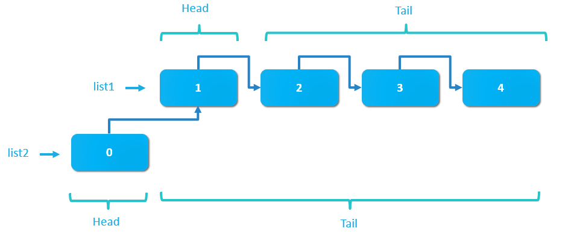

# Créer une Application web en F# 

---

## Introduction

Dans cette atelier nous allons créer une application Web en F# permettant la gestion d'un panier pour un site de e-commerce

---

## Pre-requisites

- [NET Core SDK](https://www.microsoft.com/net/download)
- [Visual Studio Code](https://code.visualstudio.com/)
- [Ionide package](https://code.visualstudio.com/)

---

# F# basic

- Value binding
- Type inference
- Namespace / Module

--

##  Value binding

**Liaisons `let`**

Un liaison associe un identificateur à une valeur ou une fonction.

```fsharp
let x = 1 // OK
x = x + 1 // ERREUR => x est immutable !!!
let y = x + 1  // OK
let x = x + 1  // Shadow

let add x y = x + y     // fonction à deux parametres 

```

--

## Variables mutables

- Le mot clé `mutable` permet de spécifier une variable pouvant être modifiée.
- Le mot clé `let` assigne une valeur initiale à une variable mutable et `<-` assigne une nouvelles valeurs.

```fsharp
let mutable x = 1   // Explicitement mutable
x <- x + 1          // Nouvelle valeur

```

--

## Inférence de type

L'inférence de type permet de déterminer le type depuis l'utilisation de la façon suivante :

- Directment depuis les litérals
- Depuis les fonctions utilisées 
- Depuis les contraintes explicites
- Sinon, generalise en type générique

--

## Inférence de type

```fsharp
let inferInt x = x + 1
let inferDecimal x = x + 1m
let inferChar x = x + 'a'
let inferString x = x + "my string"

let inferInt i = i + 1
let inferIndirectInt x = inferInt x
let inferStringList x = for y in x do printfn "%s" y  // Sequence
let inferIntList x = 99::x // list

let inferIntPrint x = printf "x is %i" x 
let inferGeneric x = x 
```

---

## Namespace et Module

En F#, un `namespace` ou un `module`est un regroupement de code (fonction, type, valeur ...)

- Le namespace est unique dans un fichier et peut contenir plusieurs modules.
- On ouvre un module ou un namespace avec le mot clé `open`

--

## Namespace et Module

```fsharp
// File: Person.fs
namespace Model

module Person = 

    // constructor
    let create first last = 
        {First=first; Last=last}

    // method that works on the type
    let fullName {First=first; Last=last} = 
        first + " " + last


open Person

let john = create "John" "Doe" 
```

---

# F# types

- Record
- Tuple
- Discriminated Unions
- Enum types
- Type Abbreviations
- Units of measure
- Collection : (List / Array / Seq)

---

## Record

Les `record` représentent des agrégats simples de valeurs nommées, éventuellement avec des membres.

```fsharp
type Point = { x: float; y: float; z: float; }

let p1 = { x = 1.0; y = 1.0; z = 1.0 }

let p1' = { p1 with x = 2.0 }
```

--

## Tuple

Un `tuple` est un regroupement de valeurs sans nom, mais ordonnées.

```fsharp
// Tuple de plusieurs types.
("one", 1, 2.0)

//déconstruire un tuple
let (a, b) = (1, 2)

```

--

# Exercice 1
## record

http://bit.ly/2GW7djm

Questions :

- Comment avez-vous modelisez l'interface ?
- Comment avez-vous modelisez la class de base ?
- Dans le cas ou deux `Book` possèdent exactement les mêmes valeurs sont ils égaux ?

---

## Discriminated Unions


Les unions discriminées permmettent de définir différent cas nommés, chacun avec des types et des valeurs différentes.

```ml
type Shape =
  | Rectangle of width : float * length : float
  | Circle of radius : float
  | Prism of width : float * float * height : float
```

--

## Enum types

Les énumérations sont des types intégraux où les étiquettes sont affectées à un sous-ensemble des valeurs. (comme en C#)

```fsharp
// Declaration of an enumeration.
type Color =
   | Red = 0
   | Green = 1
   | Blue = 2
// Use of an enumeration.
let col1 : Color = Color.Red
```

--

## Single case union types

Il est possible d'utiliser une unions discriminées avec un seul cas qui sera utilisé pour encapsuler un type. 

```ml
type EmailAddress = EmailAddress of string

let email = EmailAddress "some.amazing@email.com"

// Destructuration
let (EmailAddress rawValue) = email
```

--

## Type Abbreviations

Un abréviation de type est un alias de nom pour un type.

```fsharp
type EmailAddress = string
type Country = string

let country = "France"
let mail:EmailAddress = country  // possible car ce sont des string

```

--


# Exercice 2
## Union types

http://bit.ly/2FdkqCP

---

## Units of measure

Les nombres peuvent avoir des `unités de mesure`, ce qui permet au compilateur de vérifier que les relations arithmétiques sont éxécutées sont les bons types.

```
// Distance
[<Measure>] type m
[<Measure>] type cm

let x = 1.0<cm>
let y 1.0<m>
let z = x + y // Erreur: On ne peut pas aditionner des cm et m
```

--

# Exercice 3
## Units of measure

http://bit.ly/2Res2v1

---

## Collections

Trois types de collections sont souvent utilisées en F#

- **List** :    liste chaînée
- **Array** :   tableau
- **Seq** :     IEnumerable


--

## Lists vs Arrays vs Sequences

```fsharp
// list
let myList = [1; 2]

// array
let myArray = [|1; 2|]

// Seq
let mySeq = seq { yield 1; yield 2 }
```

--

## La liste F#

Le liste est une liste chaîné



--

## La liste F#

```fsharp
let numbers = [2; 3; 4] // créer une liste
let newNumbers = 1 :: numbers // Ajouter 1 en tête
let twoLists = numbers @ [5; 6] // concaténer deux listes

let empty = []
let ns = [1 .. 1000]
let odds = [1 .. 2 .. 1000]

let oddsWithZero = [ yield 0 
                     yield! odds ]

let gen = [ for n in numbers do 
             	    if n%3 = 0 then 
                      yield n * n ]
```


--

# Exercice 4
## list

http://bit.ly/2LUUxYS


---

# Question ?
